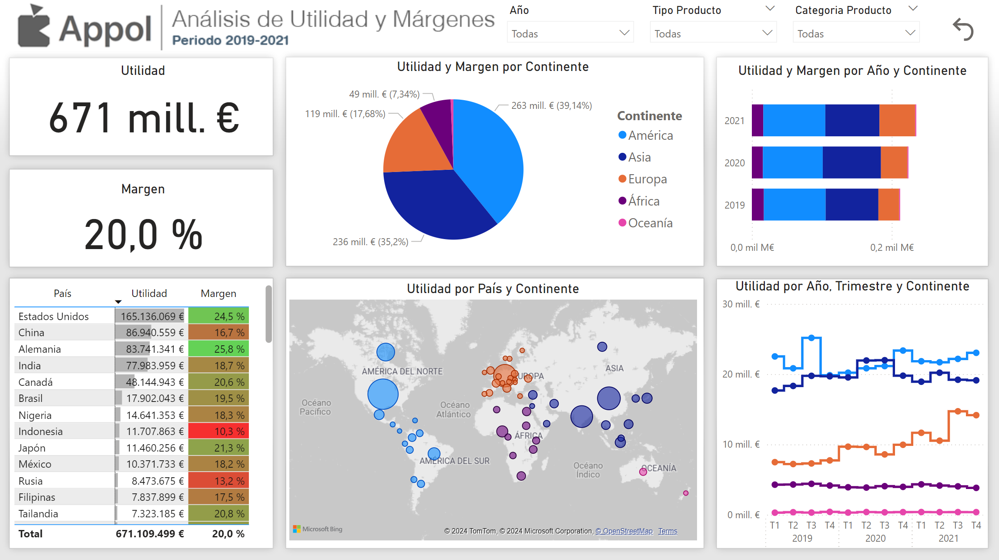

# Análisis de utildad y márgenes de la empresa Appol

## Explicación

Análisis de utilidad y márgenes de la empresa ficticia Appol en el periodo de 2019 a 2021.

Appol cuenta con un resumen de ingresos y gastos registrados en el periodo de 2019 a 2021. Todos estos registros son referentes a las categorías de sus productos y regiones. La compañía requiere conocer los indicadores de Utilidad (Ganancia) y Margen (% proporcional de la Utilidad respecto a los Ingresos) para medir el desempeño de los productos y regiones, para de esa forma proceder a la toma de decisiones y desarrollo de estrategias.

